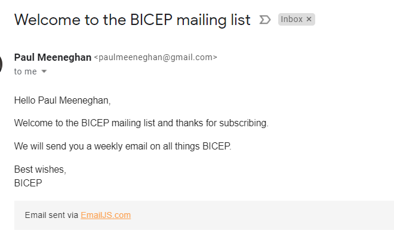

# BICEP fan site
Bicep are an electronic music production and DJ duo from Belfast, Northern Ireland, consisting of Andrew Ferguson and Matthew McBriar. This is a fan page for the DJ duo.
<br>
View the live site [here](https://pmeeny.github.io/CI-MS2-BicepMusicFanSite)
<br><br>


<br>

# Table of Contents
- [Project Overview](#project-overview)
- [UX](#ux)
  * [Strategy](#strategy)
    + [Primary Goal](#primary-goal)
  * [Structure](#structure)
  * [Scope](#scope)
    + [User Stories Potential or Existing Customer](#user-stories-potential-or-existing-customer)
    + [User Stories Website Owner](#user-stories-website-owner)
  * [Skeleton](#skeleton)
    + [Wireframes](#wireframes)
      - [Desktop](#desktop)
      - [Tablet](#tablet)
      - [Mobile](#mobile)
  * [Surface](#surface)
    + [Color Palette](#color-palette)
    + [Typography](#typography)
- [Features](#features)
  * [Existing Features](#existing-features)
    + [Feature 1 Navigation Bar](#feature-1-navigation-bar)
      - [Description](#description)
      - [User Stories](#user-stories)
    + [Feature 2 Footer](#feature-2-footer)
      - [Description](#description-1)
      - [User Stories](#user-stories-1)
    + [Feature 3 Index Page](#feature-3-index-page)
      - [Description](#description-2)
      - [User Stories](#user-stories-2)
    + [Feature 4 About Page](#feature-4-about-page)
      - [Description](#description-3)
      - [User Stories](#user-stories-3)
    + [Feature 5 Events Page](#feature-5-events-page)
      - [Description](#description-4)
      - [User Stories](#user-stories-4)
    + [Feature 6 404 Page](#feature-6-404-page)
      - [Description](#description-5)
      - [User Stories](#user-stories-5)
    + [Feature 7 Quiz Page](#feature-7-quiz-page)
      - [Description](#description-6)
      - [User Stories](#user-stories-6)
  * [Features Left to Implement](#features-left-to-implement)
- [Technologies Used](#technologies-used)
  * [Languages](#languages)
  * [Libraries and other resources](#libraries-and-other-resources)
- [Testing](#testing)
- [Deployment](#deployment)
  * [Ticketmaster API](#ticketmaster-api)
  * [Spotify API](#spotify-api)
  * [Google Maps API](#google-maps-api)
  * [Email JS](#email-js)
  * [Cypress Testing framework.](#cypress-testing-framework)
- [Credits](#credits)
- [Content](#content)
- [Media](#media)
- [Acknowledgements](#acknowledgements)

<small><i><a href='http://ecotrust-canada.github.io/markdown-toc/'>Table of contents generated with markdown-toc</a></i></small>

# Project Overview
- This project is a website for the music DJ duo "BICEP" for submission as milestone project 2 as part of the Code Institute - Diploma in Software Development (Full stack) course.
- The website showcases the music DJ duo, their album information, event details and there is a quiz on the dj duo also.
- The website is deployed using Github pages at the following url: [BICEP](https://pmeeny.github.io/CI-MS2-BicepMusicFanSite)
- The repository on Github that contains the website source code and assets is available at the following url: [Code Repository](https://github.com/pmeeny/CI-MS2-BicepMusicFanSite)
- The website was built with a responsive look and feel for desktop, tablet and mobile devices

# UX
## Strategy
### Primary Goal
- The primary goal of the website from the site owners perspective is to showcase the duo's music on spotify, let fans know about upcoming events, let fans learn more about the djs duo and to subscribe to their mailing list 
- The primary goal of the website from a site users perspective is to view and listen to the duo's music on spotify, learn about upcoming events, learn more about the djs duo and to subscribe to their mailing list 
## Structure
I have structured the website into five pages, each with clear, concise structure, information and purpose. I use the Bootstrap grid system throughout, which gave a consistent structure and responsive design "out of the box"
1. Index: The index(homepage): This is the first page the user encounters, it contains
2. About: The about page reads information from Spotify and displays the bands 2 albums with album information, track listing(with links), the dj's top tracks and the ability to listen to these top tracks on the page in a media player
3. Events: The events page reads information from ticketmaster on all of biceps events with date, time, title, ticket information and a link to the google map of where the event will be
4. Quiz: The quiz page asks 10 questions on the dj duo, with a timer, and displays the top score for the user for the browser session
5. 404: The 404 error page has a consistent header and footer that is displayed if the user enters in an incorrect url when accessing the site.
## Scope
### User Stories Potential or Existing Customer
The user stories for the website user(a potential or existing customer) are described as follows: 
- As a website user the navigation bar is displayed with a logo on the Index, About, Events, 404 and Quiz pages for easy navigation
- As a website user I can access the djs spotify, facebook, twitter and instagram pages via a link on the footer
- As a website user I can access the About Page by clicking on a link on the index(homepage) page
- As a website user I can access the Events Page by clicking on a link on the index(homepage) page
- As a website user I can access the Quiz Page by clicking on a link on the index(homepage) page
- As a website user I can sign-up to the BICEP email list by clicking on a link on the index(homepage) page, entering my full name and email address and clicking the Submit button on the modal screen to Submit or Close to close the modal
- As a website user I can view track listing, album cover image and album about Biceps two albums
- As a website user I can view album information when I hover over an album image
- As a website user I can listen to the dj's albums in spotify by clicking on a particular track
- As a website user I can view the top tracks for the DJ duo
- As a website user I can click on a top track and it will play a 30 second clip on a media player in the page
- As a website user I can view upcoming events from ticketmaster with date, time, title, ticket purchase information
- As a website user I can click next and previous on the event pages and select a particular page, the events on that page will be displayed
- - As a website user I can click the Buy Tickets link for an event and it will open up the event in ticketmaster in a new tab 
- As a website user I can click on an event and view the event venue name and google map information
As a website user if I enter in an incorrect url or page, I will be presented with a 404 page with consistent header and footer
- As a website user I can take a quiz of 10 questions on the DJ duo
- As a website user I can view a timer on the quiz
- As a website user I can view my top score for the browser session
- As a website user I can view the question number, and the correct(green color) and incorrectly selected answer(red color) is displayed as I complete the question
- As a website user I can view a summary of my answers for the quiz with the correct and incorrect answers displayed
### User Stories Website Owner
The user stories for the website owner are described as follows: 
- As a website owner I want to display links to spotify, facebook, twitter and instagram pages via a link
- As a website owner I want to provide the ability for a user to sign-up to a mailing list
- As a website owner I want to display track listing, album cover and album information about Biceps two albums, and the ability to listen to these tracks in Spotify
- As a website owner I want to display top tracks for the dj duo and the ability to listen to these top tracks on the page
- As a website owner the top tracks displayed and clicking on one  will play a 30 second clip on a media player in the page
- As a website owner I want to display upcoming events from ticketmaster with date, time, title, ticket and map information
- As a website owner I want the ability for users to buy tickets link on an event, and this will open up the event on the ticketmaster website
- As a website owner I want to display a quiz for users, and that they can see their top score, a timer for the attempt and correct and incorrect answers, wit a summary of all answers
## Skeleton
### Wireframes
- Wireframes for the website were developed in Balsamiq and are linked below for Desktop, Tablet and Mobile devices.
- The wireframes are stored in GIT in the png format and are available at the links below(Desktop, Tablet and Mobile wireframes)
- One overall pdf containing all wireframes is also stored in the GIT at the following location: - [All Wireframes in PDF format](assets/wireframes/Wireframes_allformats.pdf)

#### Desktop 
- [Index](assets/wireframes/desktop/index_desktop.png)
- [About](assets/wireframes/desktop/about_desktop.png)
- [Events](assets/wireframes/desktop/events_desktop.png)
- [Quiz](assets/wireframes/desktop/quiz_desktop.png)

#### Tablet
- [Index](assets/wireframes/tablet/index_tablet.png)
- [About](assets/wireframes/tablet/about_tablet.png)
- [Events](assets/wireframes/tablet/events_tablet.png)
- [Quiz](assets/wireframes/tablet/quiz_tablet.png)

#### Mobile
- [Index](assets/wireframes/mobile/index_mobile.png)
- [About](assets/wireframes/mobile/about_mobile.png)
- [Events](assets/wireframes/mobile/events_mobile.png)
- [Quiz](assets/wireframes/mobile/quiz_mobile.png)

## Surface
### Color Palette
I have gone for a simple and minimal design for the website, with black and white font colours over a large hero image on all pages
There are four colours in the color palette with a 
- #FFFFFF - White colour for text on background images
- #000000 - Black colour for text on a white background
- #0062CC - Blue colour for buttons and links
- rgba(255,255,255,.5) - Grey colour for not selected navbar icons and text

- I feel the colours complement each other very well, and I choose those colours after testing a number of palettes while making sure the colour palette met accessibility standards.

### Typography
The Roboto font is the main font used throughout the whole website with Sans Serif as the fallback font in case for any reason the Roboto font cannot be imported into the website correctly. This font is from the Google fonts library.

# Features
The website has five webpages consisting of seven distinct features and they are described below
## Existing Features
### Feature 1 Navigation Bar
#### Description
This is the navigation bar of the website, and is displayed on the Index(Homepage), About, Events, Quiz and 404 pages. The navigation bar is a bootstrap component, and is a responsive component. It becomes a burger menu on tablet and mobile devices.


#### User Stories
- User Story 1.1: As a website user the navigation bar is displayed with a logo on the Index, About, Events, 404 and Quiz pages for easy navigation

### Feature 2 Footer
#### Description
The footer is displayed on the Index(Homepage), About, Events, Quiz and 404 pages. It contains links to the djs spotify, facebook, twitter and instagram pages


#### User Stories
- User Story 2.1: As a website user I can access the djs spotify, facebook, twitter and instagram pages via a link on the page footer

### Feature 3 Index Page
#### Description
The index page contains the header, footer, hero image and hero text and 4 image links to the About, Events, Quiz pages and mailing list modal
The mailing list modal consists of two fields(full name and email address). When the user enters their information and clicks Submit, the EmailJS API is called to send an email to the user. The email template was configured in Email JS.




#### User Stories
- User Story 3.1: As a website user I can access the About Page by clicking on a link on the index(homepage) page
- User Story 3.2: As a website user I can access the Events Page by clicking on a link on the index(homepage) page 
- User Story 3.3: As a website user I can access the Quiz Page by clicking on a link on the index(homepage) page
- User Story 3.4: As a website user I can sign-up to the BICEP email list by clicking on a link on the index(homepage) page, entering my full name and email address and clicking the Submit button on the modal screen to Submit or Close to close the modal

### Feature 4 About Page
#### Description
- The About page has 3 main sections. The first section is some about text taken from the dj's wikipedia page.
- The 2nd and 3rd section read information from the spotify api and display it on the screen. The javascript to do this is stored in the about.js file.
- The first api call is a fetch api call to get a token `"https://accounts.spotify.com/api/token"`. A clientID and clientSecret is passed into the call, and a token is returned, that is used for future spotify api calls in the browsers session. All calls made to spotify return a json object. This object is then parsed and its contents are displayed on the page.
- The second section displays information about the 2 BICEP albums.

- The album image cover, and track listing is displayed on screen for each album. The token acquired is used to make two spotify api calls: `https://api.spotify.com/v1/albums/` (one for each album id) Each track is a url to that track in Spotify. When the user hovers over the album image cover, the image flips to display album information: name, release date, label, track count.

- The third section displays the top tracks for the artist. Once again a subsequent call is made to the spotify api using the token acquired. The call is `"https://api.spotify.com/v1/artists/" + bicepArtistID + "/top-tracks?market=IE"`
- When a track is clicked, a 30 second snippet automatically starts playing in the media player embedded on the page. 


#### User Stories
- User Story 4.1: As a website user I can view track listing, album cover image and album information about Biceps two albums
- User Story 4.2: As a website user I can view album information when I hover over an album image
- User Story 4.2: As a website user I can listen to the dj's albums tracks in a new tab in spotify by clicking on a particular track
- User Story 4.3: As a website user I can view the top tracks for the DJ duo
- User Story 4.4: As a website user I can click on a top track and it will play a 30 second clip on a media player in the page

### Feature 5 Events Page
#### Description
- The event page uses the ticketmaster and google map and geocoding apis's. The javascript to do this is stored in the events.js file.
- An API key was setup for both platforms(ticketmaster and google)
- The main ticketmaster api call is `"https://app.ticketmaster.com/discovery/v2/events.json?keyword=bicep&apikey=MYAPIKEY&size=2&locale=*&page=page` and is made using Ajax. This returns a json object that is then parsed and its relevant contents displayed on the events page.
- Each event is displayed with its date, time, title, and ticket purchase information.
- Clicking an event displays the venue, that venue text is then passed into the google maps api and google geocoding api to then display a google map of the location, the function written to do this is `geocodeAddress(geocoder, map, address)`
- The google maps geocode api is used to translate the event name returned from ticketmaster and translate to a the google maps location on the events.html page   
- Pagination is also a feature of this page with 2 events loaded per page, and next, previous links, and the ability to click on a page number and display events for that page.


#### User Stories
- User Story 5.1: As a website user I can view upcoming events from ticketmaster with date, time, title, ticket purchase information
- User Story 5.2: As a website user I can click next and previous on the event pages and select a particular page, the events on that page will be displayed
- User Story 5.3: As a website user I can click the Buy Tickets link for an event and it will open up the event in ticketmaster in a new tab 
- User Story 5.4: As a website user I can click on an event and view the event venue name and google map information

### Feature 6 404 Page
#### Description
- The 404 page is displayed if the user enters a url that does not exist. The 404 page has a footer, header and text to ask the user are they sure they entered the correct url

#### User Stories
- User Story 6.1: As a website user if I enter in an incorrect url or page, I will be presented with a 404 page with consistent header and footer

### Feature 7 Quiz Page
#### Description
- The quiz page is an interactive quiz consisting of 10 questions. The questions are stored in the questions.js javascript file, and the quiz functionality is in the javascript file quiz.

- As the user selects their answer and clicks submit, the correct answer is highlighted in green, and the incorrectly selected answer is highlighted in red.
- When all questions are answered, a summary page is displayed showing the correct and incorrect answers the user submitted.

- A timer starts when the quiz starts and stops after the last question.
- A percentage bar displays the progress of the user
- The users top score is displayed, and updated whe the user gets a top score. This information is stored in the browsers session storage: `sessionStorage.getItem("topScore")`
- If the user takes the quiz twice in the browser session, the top score will be displayed on the quiz page, and this will be updated accordingly

#### User Stories
- User Story 7.1: As a website user I can take a quiz of 10 questions on the DJ duo
- User Story 7.2: As a website user I can view a timer on the quiz
- User Story 7.3: As a website user I can view my current quiz score and top score for the browser session
- User Story 7.4: As a website user I can view the question number, and the correct(green color) and incorrectly selected answer(red color) is highlighted as I complete the question
- User Story 7.5: As a website user I can view a summary of my answers for the quiz with the correct and incorrect answers displayed

##  Features Left to Implement
- I am content with what was implemented. The site is a responsive interactive website using a number of external API's, however in the cases of using the spotify and ticketmaster API's, I could have used other calls, and then displayed more information about the artists music or ticketmaster events.
- A search area for the whole website in particular the events page would be a useful addition to add
- To use the spotify api I had to include the client id and client secret in the javascript file(about.js) From a security perspective the client secret should not be exposed. As this is a frontend project, it was not in scope to have a backend part. However to implement the spotify api correctly from a security perspective I would have like to have a backend element(node for example) and store the client secret in the backend so it is not exposed at the frontend.

# Technologies Used
## Languages 
- HTML (https://en.wikipedia.org/wiki/HTML)
    - The project uses html to build the relevant pages
- CSS (https://en.wikipedia.org/wiki/CSS)
    - The project uses CSS to style the relevant pages
- Javascript (https://www.javascript.com/)
    - Javascript was used for all scripting on the site

## Libraries and other resources
- Bootstrap 4.6 (https://getbootstrap.com/docs/4.6)
    - The project uses the bootstrap library for some of the UI components in the website
- Git (https://git-scm.com/)
    - Git was used as the source control tool for this project
- Github (https://github.com/)
    - Github was used to store the project code in a repository
- Guthub desktop (https://desktop.github.com/)
    - Github desktop was used to view and make commits into GIT
- Microsoft VSCode (https://code.visualstudio.com/)
    - A locally installed Integrated Development Environment
    - I also installed a number of extensions: Code Spell Checker, Beautify, Auto Rename Tag, Git, GitLens
- Google Fonts (https://fonts.google.com/)
    - Google font Roboto was used as the website font
- Balsamiq (https://balsamiq.com/)
    - Balsamiq was used to create the website wireframes
- Font Awesome (https://fontawesome.com/)
    - Font awesome was used to provide the relevant fonts/icons for the website
- JQuery (https://jquery.com)
    - JQuery was used throughout in several of the javascript files fro DOM manipulation
- TinyPNG (https://tinypng.com/)
    - TinyPNG was used to compress images
 - CSS Validation Service (https://jigsaw.w3.org/css-validator/)
    - CSS validation service for validation the css in the project  
- HTML Markup Validation Service (https://validator.w3.org/)   
    - HTML validation service for validation the css in the project  
- Chrome dev tools (https://developers.google.com/web/tools/chrome-devtools)
    - For troubleshooting and debugging of the project code
- Chrome Lighthouse (https://developers.google.com/web/tools/lighthouse)
    - For performance, accessibility, progressive web apps, SEO analysis of the project code
- Responsive Design (http://ami.responsivedesign.is/)
    - Website for generating the responsive image in this README
- JS Fiddle (https://jsfiddle.net/)
    - Used for testing html and css concepts
- GitHub Wiki TOC generator (https://ecotrust-canada.github.io/markdown-toc/)
    - Used for generating a table of contents for this README
- Cypress (https://www.cypress.io)
    - Cypress was used for automated e2e testing of all pages 
 - Cypress Code Coverage (https://docs.cypress.io/guides/tooling/code-coverage)      
    - Cypress was configured to generate code coverage
- Istanbul (https://istanbul.js.org/)   
    - Istanbul was used to instrument the javascript files in the project
- Spotify API (https://developer.spotify.com)
    - The spotify API is used to get data in json from spotify and display it on the about.html page
- Ticketmaster API (https://developer.ticketmaster.com)
    - The ticketmaster API is used to get data in json from ticketmaster and display it on the events.html page
- Google Maps api (https://developers.google.com/maps)
    - The google maps api is used to display the google maps on the events.html page
- Google maps geocode API (https://developers.google.com/maps/documentation/geocoding/start)
    - The google maps geocode api is used to translate the event name returned from ticketmaster and translate to a the google maps location on the events.html page   
- Gofullpage chrome plugin  (https://chrome.google.com/webstore/detail/gofullpage-full-page-scre)
    - This plugin was used to take full page screenshots for testing images

# Testing
The testing information and results for this project are documented in [TESTING.md](TESTING.md)

# Deployment
The website was developed using the Visual Studio Code IDE due to the extensibility of the Visual Studio Code IDE and I plan on using this IDE for future projects. 

The source code is stored in GIT in the repo: pmeeny/CI-MS2-BicepMusicFanSite(master branch) 

The website was deployed on GitHub pages (https://pages.github.com/) using the following steps
1. Log to GitHub (https://wwww.github.com)
2. Click the Repositories tab and select the repository pmeeny/CI-MS2-BicepMusicFanSite
3. In the menu, select Settings
4. Scroll down to the GitHub Pages section
5. Under source, select the master branch and save
6. The website is now deployed, and the link is displayed in the GitHub Pages section

To run this project locally, you will need to clone the repository
1. Login to GitHub (https://wwww.github.com)
2. Select the repository pmeeny/CI-MS2-BicepMusicFanSite
3. Click the Code button and copy the HTTPS url, for example: https://github.com/pmeeny/CI-MS2-BicepMusicFanSite.git
4. In your IDE, open a terminal and run the git clone command, for example 

```git clone https://github.com/pmeeny/CI-MS2-BicepMusicFanSite.git```

5. The repository will now be cloned in your workspace

The project uses a number of API's and the Cypress testing framework, below are the steps to configure the API in your environment
## Ticketmaster API
1. Create an account at https://developer-acct.ticketmaster.com/user/register
2. Once you create the account, you will need to create a project, and you will be assigned a consumer key and consumer secret
[Ticketmaster](assets/images/readme/css-validation/ticketmaster_api.PNG)
3. Take a note of the consumer key, copy its value and update the variable ticketmasterAPIKey in the events.js file with its value

## Spotify API
1. Create an account at https://developer.spotify.com/dashboard/applications
2. Once you create the account, you will need to create a project, and you will be assigned a client id and client secret
[Spotify](assets/images/readme/css-validation/spotify_api.PNG)
4. Take a note of the client id and client secret
5. Copy their values, and update the value of the variables clientId and clientSecret in the about.js file with their values

## Google Maps API
1. Create an account at https://console.developers.google.com
2. Create an API key and setup the account as requested by google, for example billing information
3. Configure 2 API's, Maps JavaScript API and Geocoding API
3. In the credentials screen, set the web restrictions url referrer to the urls of where the site will be hosted as well as your local development environment, for example http://127.0.0.1:5500/
4. In the API restrictions section in the credentials screen, limit to 2 API's: Maps JavaScript API and Geocoding API
5. In the events.html file under the footer, update the google maps script src to include your API key

## Email JS
1. Create an account at emailjs.com 
2. In the integration screen in the emailjs dashboard, note your userid
3. Create a 
 email service in the Email Services section and note the id
4. Create a email template in the Email templates section and note the id
5. Update the script sendEmail.js, method sendMail with your user id, email service id and email template id

## Cypress Testing framework.
1. Create an account at cypress.io
2. Setup a project in the dashboard at cypress.io
3. Install cypress in your development environment by following the steps in https://docs.cypress.io/guides/getting-started/installing-cypress
4. The testcases/scripts for this project are available at /cypress/integration
5. Check that cypress is configured correctly so that the 6 test cases can be run locally with Cypress. These are described in greater detail in the TESTING readme file
6. In each test case update the cy.visit call with your local server ipaddress and port, for example http://127.0.0.1:5500
7. To setup code coverage for your tests follow the steps at https://docs.cypress.io/guides/tooling/code-coverage
8. The code coverage generated at each run is available in a coverage folder

# Credits
- In the file events.js, I built on a tutorial that described connecting to the ticketmaster api, and parsing the json data that is returned: https://developer.ticketmaster.com/products-and-docs/tutorials/events-search/search_events_with_discovery_api.html

- In the file about.js, I built on a tutorial that described using the spotify api to return json data: https://developer.spotify.com/documentation/web-api/libraries/. I also used the google maps api and geocode api: https://developers.google.com/maps/documentation/geocoding/start 

- For the social media icons in the footer, I used the code with some modifications from the Code Institute, CV project, reference: https://github.com/Code-Institute-Org/ucd-resume

- For the navigation bar I used the code with some modifications from the Bootstrap website: https://getbootstrap.com/docs/4.6/components/navbar/

- For the hero video and text overlay on the index.html page, I used the code with some modifications from the w3schools website: https://www.w3schools.com/howto/howto_css_fullscreen_video.asp

- I use a number of Bootstrap components and the source code in the examples: Navbar, Modal in the five webpages
    - https://getbootstrap.com/docs/4.6/components/navbar/
    - https://getbootstrap.com/docs/4.6/components/modal/

- For layouts I use the Bootstrap Grid system: https://getbootstrap.com/docs/4.6/layout/grid/

- I used the W3 schools website to find out compatibility and examples of various form components: https://www.w3schools.com/

- For the events.html pagination styling, I used an example from https://www.w3schools.com/css/css3_pagination.asp 

- For the hero image and alignment on all pages, I used the examples described in https://codetheweb.blog/fullscreen-image-hero/ and https://stackoverflow.com/questions/4240015/css-text-in-center-of-background-image

- For the stopwatch: https://jsfiddle.net/Daniel_Hug/pvk6p/

- For updating the quiz progress bar, I found this page useful: https://stackoverflow.com/questions/21182058/dynamically-change-bootstrap-progress-bar-value-when-checkboxes-checked

- The Image flipping css, used in the about.html page: https://www.w3schools.com/howto/tryit.asp?filename=tryhow_css_flip_image2

- For IE support for a dynamic div I used the code in this url: https://stackoverflow.com/questions/4075440/dynamic-height-for-div/4075456

# Content
- Wikipedia (https://wikepedia.com/)
    - The text on the about page is from wikpedia

- Pixabay (https://pixabay.com/)
    - The images on the home page, a and background on events, quiz and about pages are from pixabay

- Font Awesome (http://fontawesome.com)    
    - The fonts on the footer and header are from font awesome

- Fonts (http://https://fonts.google.com/)    
    - The text font(Lato) is from google fonts

- Spotify (http://www.spotify.com)
    - The spotify logo is from spotify.com brand guidelines and content 

- Spotify Web API (https://developer.spotify.com/documentation/web-api/)    
    - The album information is read from the spotify API

- Ticketmaster (https://developer.ticketmaster.com/products-and-docs/apis/getting-started/)     
    - The event information is read from the ticketmaster api

<br>

# Media
- Wikipedia (https://wikipedia.com/)
    - The text on index and about was taken from the dj's Wikipedia page

 <br>

# Acknowledgements
- I would like to thank my fiancee Mary for her help, constant support and ideas for the website, my son Liam who was born in March while I worked on this project, and also to my dog Lily for her company during development of the website.
- I would like to thank my mentor Mo Shami for his input, help and feedback.